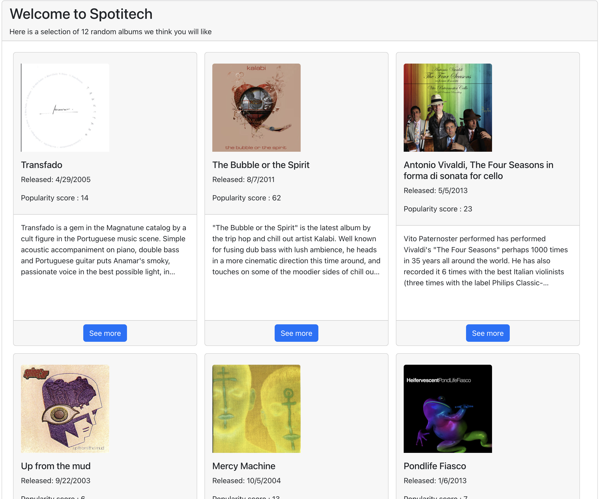
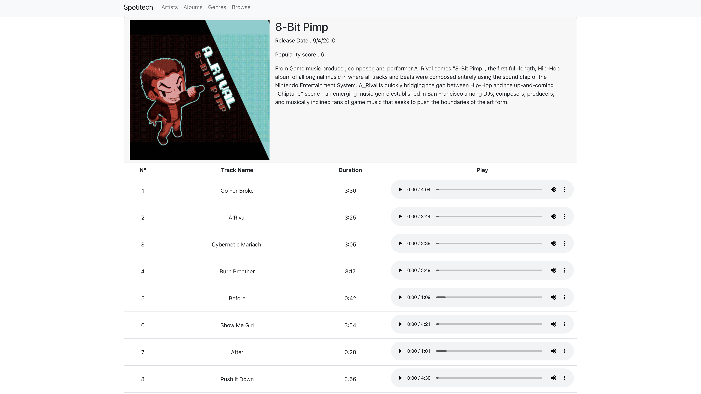

# Spotitech

This project is based around the Spotitech API (available here: https://hub.docker.com/r/matfire/spotitech). It is an online audio player where you can discover artists and listen to their albums.





It is my first React website ever !

### Project restrictions
- React.js for the front-end

### Things I learned making this project
- React.js
- React-Vootstrap
- Fetching data from an API (axios)
- Promise handling
- Nested AJAX requests and hand pagination

### Pre-requisites
Docker, Docker Compose

## Installation
Clone the repo to get started.

At the root of the repo, run
```sh
docker-compose up -d
```
If you go to http://localhost:8000/api you should see the SwaggerUI interface and see all the endpoints.

Go into the "spotitech" folder, and run
```sh
npm run start
```

Go to http://localhost:3000

Enjoy your visit !

## License
MIT
